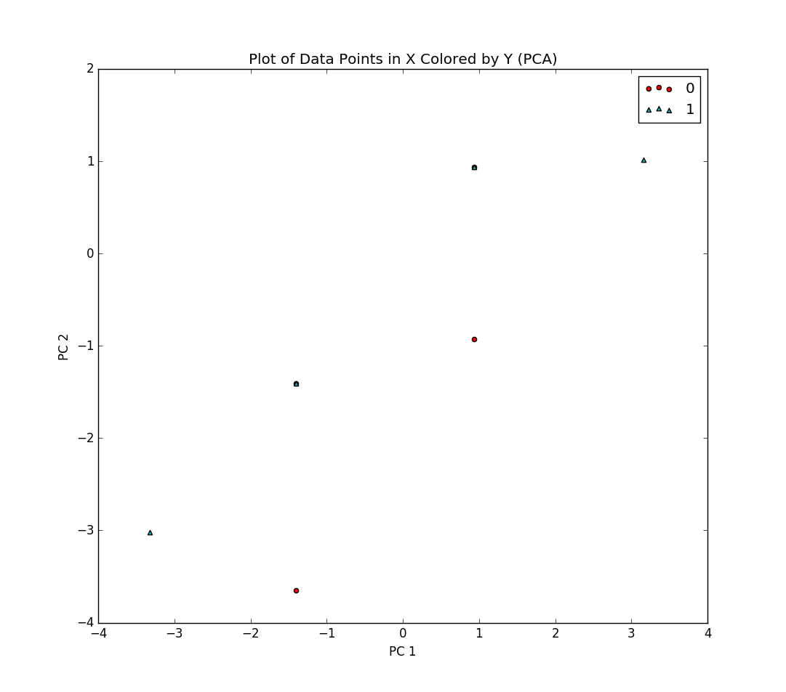
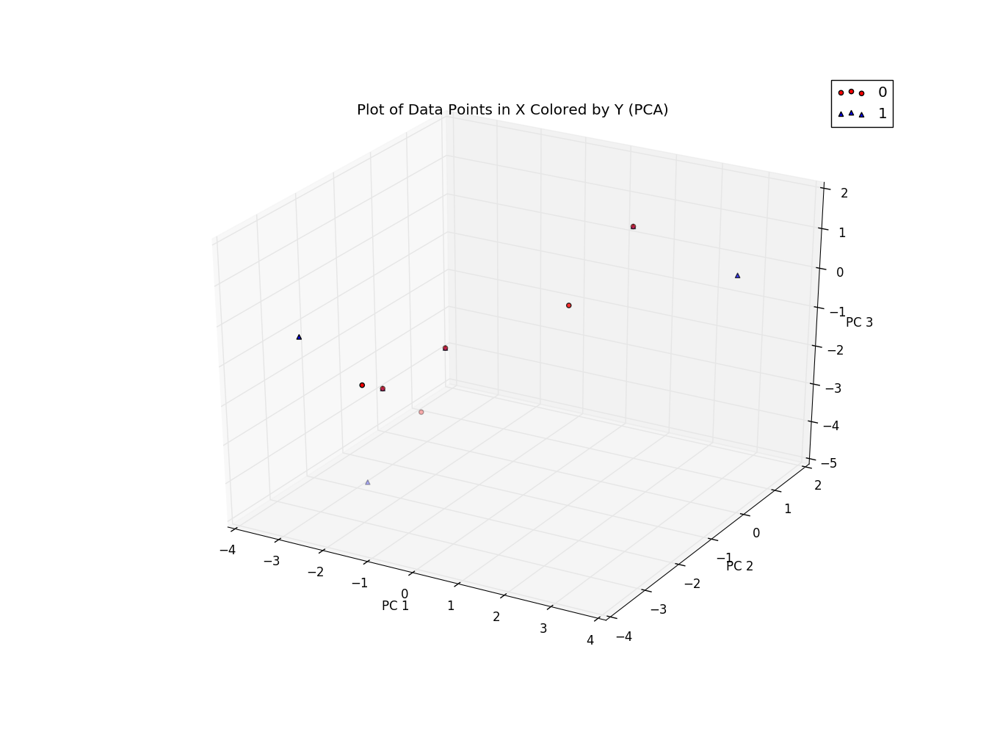

Milestone 3
===========

This milestone consisted of performing PCA on our dataset and comparing models built both with and without PCA having been performed on the data used for training. We used a stochastic gradient descent-based logistic regression classifier as basis for comparison for models. The full dataset was used to perform cross-validation on all models.

We built models using 2-component PCA and 3-component PCA in addition to our regular SGD logistic regression classifier. Visualizations of the new feature spaces can be found below:

2-Component PCA | 3-Component PCA
------------ | -------------
        | 

After training these models, we used 50 runs of 10-fold cross validation to create a dataset for statistical comparison of the models. Using a one-way ANOVA test, we found statistical significance for differences across the validation errors of the three models (`F=5.7107`, `p=0.0041`). Using Fisher's LSD for post-hoc testing, we found no differences between the two PCA-based models (`t=-0.0508`, `p=0.9597`). We did, however, find differences between the PCA classifiers and the non-PCA classifier: the 2-component PCA model showed statistically significant differences from the non-PCA classifier (`t=4.1573`, `p=0.0001`) and the 3-component PCA model showed statistically significant differences from the non-PCA classifier (`t=4.0996`, `p=0.0002`).

The mean validation errors of the stochastic gradient descent logistic regression classifiers are as follows:

Classifier  | Mean
------------|-----------
2-Component PCA | 0.5670
3-Component PCA | 0.5670
Non-PCA | 0.5651

