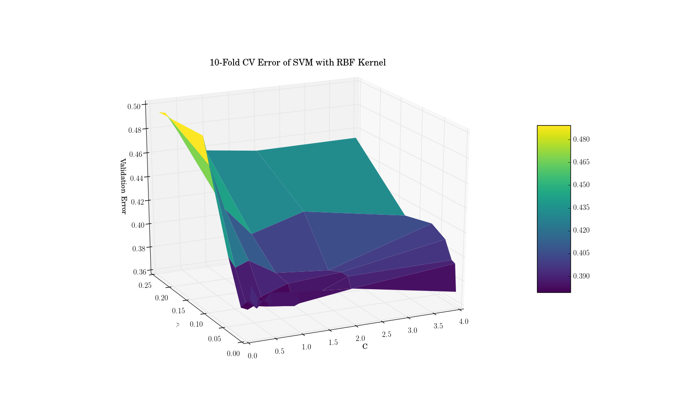

<h2>Optional Task 4: SVM</h2>

This optional task dealt with the creation of a support vector machine for classification purposes. The SVM used had a RBF kernel. Using 10-fold cross validation, hyperparameters __C__ and __gamma__ were chosen such that they minimized the validation error of the SVM. The data was split into classes based on a median split by the number of shares, our target feature. Due to computational bottlenecks, N = 4000 data points were used to train the classifier.

To train the SVM, just run `python classifysvm.py` on a textfile containing our data. The output of the script is the optimal hyperparameters for the SVM.

The following is a surface plot showing the validation error surface of the SVM:

