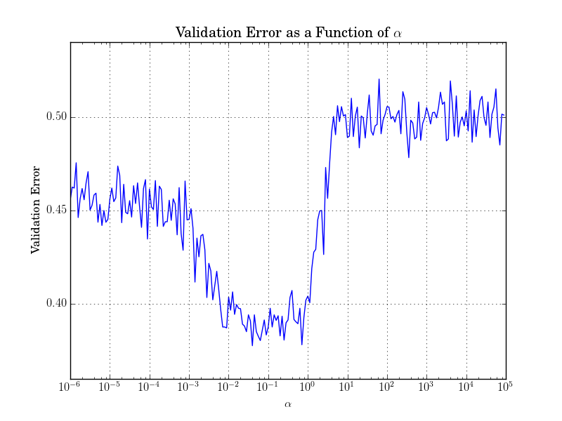

<h2> Optional Task 5: Model Evaluation</h2>

This optional task involved the evaluating and comparing two different models and statistically testing them to see if there was a significant difference in their validations accuracies on our dataset. To complete this task, we used the SVM trained for Optional Task 4 and a logistic regression classifier using stochastic gradient descent. 

To train the logistic regression classifier, we used 10-fold cross validation to choose the optimal __alpha__ parameter for step size. The plot below shows the validation error as a function of __alpha__. To keep future statistical testing valid, we used N = 4000, just like we did for the support vector machine with RBF kernel that was used in Optional Task 4.

Following the training of the SGD logistic regression classifier, we performed a statistical analysis using a paired-samples t-test. To generate the data for the t-test, we ran 50 instances of 10-fold cross-validation on the previously trained SVM and SGD logistic regression classifiers. Based on the results (t=3.3256, p=0017), we can conclude that there is a statistically significant difference in the validation errors produced by the support vector machine (m=0.6179) and SGD linear regression classifier (m=0.6157).
