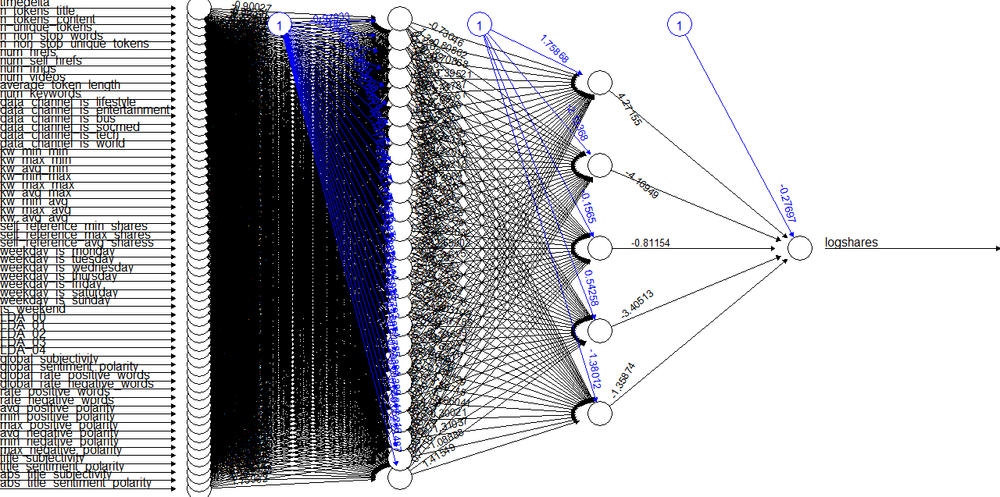

<h2> Optional Task 8: Neural Network</h2>

This optional task involved training and runing a Neural Network and evaluating the predictions using 10-fold cross-validation and a suitable error measure.

Code for this task is in the neural_net.R file and can be run using R version 3.4.3. Packages used include dplyr, caret, and neuralnet. The website https://www.r-bloggers.com/fitting-a-neural-network-in-r-neuralnet-package/ provided a useful introduction to the neuralnet package and how it can be used.

To reduce computation time, we chose N = 500. Data was first mean centered and scaled to have a standard deviation of 1. Then, 10-fold cross validation was used to choose between 3 2-hidden-layer neural networks with different numbers of hidden nodes. On an HP Spectre laptop computation time for 10-fold Cross Validation was 211.98 seconds. Average mean squared error (MSE) values for these networks computed during cross validation are shown in the following table

| Number of Nodes in Hidden Layer 1        | Number of Nodes in Hidden Layer 2          | Cross Validation MSE  |
| ---- |:----:| -----:|
| 20    | 10   | 1.94|
| 25   | 5   | 1.77|
| 15   | 10  | 2.03|

Based on this information we chose a neural network with 25 and 5 hidden nodes.

We then split the data into one training and test set and retrained the neural network. Computational time to train this single neural network was 11.50 seconds. The resulting network is shown in the following plot. 

This network resulted in an MSE of 1.63.
